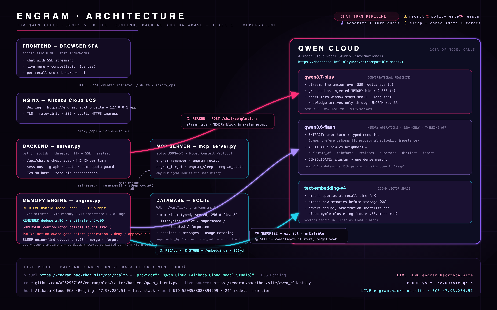

# ENGRAM — a verifiable memory control plane for Qwen agents

**RAG retrieves documents. ENGRAM governs an agent's evolving beliefs and
actions: it recalls under a fixed token budget, revises beliefs instead of
piling up contradictions, consolidates while it "sleeps", denies unsafe
actions before generation, and replays every decision it makes.** Across reproducible
runs on the same Qwen model: **5/5 scenarios**, 2.6–2.8× smaller prompts
than full-history stuffing, a memory store 94–95% smaller than raw
history, critical recall succeeding at semantic similarity 0.25–0.31, and
zero stale-fact leakage.

> **Global AI Hackathon Series with Qwen Cloud · Track 1: MemoryAgent**
>
> **Try it:** https://engram.hackthon.site · **DevOps agent scenario:** https://engram.hackthon.site/?seed=devops
> **Origin (Alibaba Cloud ECS, Beijing):** https://engram.hackthon.site · **Demo video (2:07, narrated):** https://youtu.be/teJQ3MEEFJY
>
> **One click on the live demo: ▶ RUN THE JUDGE DEMO (≈2 min, 5 live-verified checks)** — auto-plays teach →
> cross-session recall → belief revision (supersede) → sleep-cycle consolidation.
> Hover any recall chip for its weighted score breakdown; switch scenarios with the
> PERSONAL / DEVOPS RUNBOOK tabs.
>
> Judges: [**JUDGING.md**](JUDGING.md) is a 5-step verification path (10 s → 10 min) ·
> [**docs/proof-of-deployment.md**](docs/proof-of-deployment.md) proves the Alibaba Cloud runtime (ECS `i-2zefhmpp3htrijv7plwr`, cn-beijing-c).
> Domain https://engram.hackthon.site is live over HTTPS — ICP filing 蜀ICP备2026037600号-1 approved.

LLM agents wake up with amnesia every session. ENGRAM gives a Qwen agent a
**persistent, self-organizing long-term memory** inspired by memory lifecycle
concepts — recall, reinforcement, revision, consolidation, forgetting — and renders the whole thing live as an interactive
"memory constellation," so every recall, reinforcement, contradiction and
consolidation is visible and explainable.

Tell it once that you're vegetarian with a peanut allergy. Days later, in a
brand-new session, ask for a dinner idea — it quietly serves you something
safe. Tell it you changed jobs — the old belief is *superseded*, not
duplicated. Press **Sleep Cycle** — scattered episodic fragments consolidate
into dense semantic knowledge, and stale traces are forgotten.



## Why this is not "just RAG"

| Naive approach | ENGRAM |
|---|---|
| Append full chat history to context | **~800-token memory budget**, greedy-packed from scored memories |
| Similarity-only retrieval | Hybrid score: `0.55·semantic + 0.18·recency + 0.17·importance + 0.10·usage`, with per-type half-lives and a rescue floor for safety-critical memories (allergies surface even at low similarity) |
| Contradictions pile up | **LLM arbitration**: embeddings shortlist neighbors, `qwen3.6-flash` rules *duplicate / replaces / distinct* — changed jobs supersede, a diet and an allergy coexist |
| Store grows forever | **Sleep cycle**: union-find clustering (configurable threshold, production default cos ≥ .55, calibrated on text-embedding-v4) merges fragments into semantic summaries; retention `0.5·importance + 0.3·usage + 0.2·recency` below floor ⇒ forgotten |
| Memory is a black box | Every recall streams its **score components** to the UI; every memory keeps an audit trail (`superseded_by`, `consolidated_into`, access counts) |

## Measured, not claimed

A reproducible suite ([`eval/run_eval.py`](eval/run_eval.py), method and full
tables in [`docs/evaluation.md`](docs/evaluation.md)) benchmarks ENGRAM
against a **no-memory** and a **full-history-stuffing** baseline on the same
`qwen3.7-plus` model. All token counts are read from real Qwen Cloud usage
fields. **5/5 scenarios pass** (original benchmark run — July 4; the
final-submission re-run on July 10 also passed 5/5 with the same shape —
both runs plus ablations and a 10× stability report live in
[docs/evaluation.md](docs/evaluation.md)):

| Track 1 requirement | Measured result (July 4 run) |
|---|---|
| Recall across sessions, under noise | Allergy + diet recalled after 13 unrelated turns and a session switch; picnic menu is safe — **182 tk prompt vs 512 tk** for history stuffing |
| Timely forgetting of outdated info | Employer change fires a supersede op; **zero stale-fact leakage** in a fresh session (structural, not prompt luck) |
| Efficient storage | After 32 messages: whole store = **48 tk vs 849 tk** of raw history (94% smaller), and it *shrinks* under consolidation |
| Consolidation | Sleep cycle merges 3 Tokyo fragments → 1 dense memory; store 98 → 74 tk |
| Critical recall in a limited window | Peanut allergy surfaces at **cosine 0.25–0.31 across runs** (below the normal floor) via the importance rescue floor |

## How ENGRAM differs from generic memory layers

Plenty of projects bolt a vector store onto a chatbot. ENGRAM's specific
contributions:

1. **LLM-arbitrated belief revision** — embeddings only *shortlist*
   neighbors; a fast Qwen model rules *duplicate / replaces / distinct*.
   Measured on `text-embedding-v4`, "vegetarian" vs "eats meat now" (a
   contradiction) scores 0.76 while "vegetarian" vs "peanut allergy" (both
   true) scores 0.60 — **no cosine threshold can separate these**, so
   threshold-only memory systems either duplicate or wrongly overwrite.
2. **Safety-aware retrieval** — a rescue floor lets importance ≥ 0.85
   memories surface at low similarity (S5 above). Retrieval budget, per-type
   half-lives and reinforcement are all explicit, tunable numbers.
3. **Explainable by construction** — every recall streams its score
   components to the UI; every memory carries `superseded_by` /
   `consolidated_into` audit links. The constellation is not a splash
   screen, it is the actual store, live.
4. **Qwen-native and hackathon-verifiable** — 100% of inference on Qwen
   Cloud, full stack on Alibaba Cloud ECS, zero pip dependencies, MCP server
   included, one-command deploy.

## Beyond a personal assistant

The demo persona is deliberately simple to film, but the engine is
workflow-agnostic. The same four primitives (extract / arbitrate / budgeted
recall / consolidate) map directly onto:

- **Customer support** — remember each customer's SLA tier, compliance
  constraints and deprecated contract terms; supersede them on renewal so
  agents never quote a stale clause; keep per-ticket context under a fixed
  token budget.
- **DevOps copilots** — standing infra conventions ("always Terraform",
  "never restart the billing pod during EU hours") as procedural memories
  that survive across incidents.
- **Sales/CRM agents** — episodic call fragments consolidate into durable
  account knowledge during a nightly sleep cycle.

Because the store speaks MCP, any of these agents mounts ENGRAM without
adopting its UI or server.

### Memory lifecycle

```
user turn ─▶ EXTRACT (qwen3.6-flash, typed JSON)
                │  preference / semantic / procedural / episodic + importance
                ▼
             EMBED (text-embedding-v4, 256-d)
                │  cos ≥ .90 ──▶ reinforce existing trace (strength +1)
                │  cos ≥ .45 ──▶ ARBITER: duplicate? replaces? distinct?
                ▼                    │ replaces ⇒ old memory superseded
             INSERT (SQLite, WAL)   ◀┘
                ▼
             RECALL on next turn — hybrid score under token budget,
             recalled memories are reinforced (use strengthens the trace)
                ▼
             SLEEP CYCLE — consolidate clusters ⇒ semantic knowledge,
             forget low-retention traces (grace period for young memories)
```

## Built on Qwen Cloud (Alibaba Cloud)

All model calls go through **[`backend/qwen_client.py`](backend/qwen_client.py)**
— this file is the proof of Alibaba Cloud usage (also served read-only from
the production ECS at https://engram.hackthon.site/qwen_client.py) — against the Qwen Cloud
Model Studio international endpoint:

```
https://dashscope-intl.aliyuncs.com/compatible-mode/v1
```

| Model | Role |
|---|---|
| `qwen3.7-plus` | conversational reasoning, SSE streaming, grounded on the injected MEMORY block |
| `qwen3.6-flash` | memory extraction (typed+scored JSON), contradiction arbitration, sleep-cycle summarization |
| `text-embedding-v4` | 256-dim vectors for recall, dedupe and clustering |

The full stack (nginx + systemd + SQLite + backend) is deployed on
**Alibaba Cloud ECS instance `i-2zefhmpp3htrijv7plwr` (cn-beijing-c)** —
live at https://engram.hackthon.site — with a
public HTTPS ingress via nginx on the same ECS. All model inference (reasoning, extraction,
arbitration, embeddings) runs on Qwen Cloud, so both the hosting and the AI
backbone are Alibaba Cloud. Deployment proof video:
https://youtu.be/DDso1eEqKTo

## Zero-dependency engineering

The production host is a **1-core / 728 MB** CentOS 7 box, so ENGRAM is
**pure Python 3.6 stdlib** — no pip install, no frameworks, no vector DB:

- `backend/server.py` — threaded HTTP + Server-Sent-Events API (~300 lines)
- `backend/engine.py` — the memory engine (~500 lines)
- `backend/qwen_client.py` — Qwen Cloud client with retry/backoff
- `backend/mcp_server.py` — the same engine exposed over MCP
- `frontend/index.html` — single-file UI, no frameworks: canvas force-layout
  constellation, SSE chat, retrieval-score chips, embedded fonts

Guard rails: per-IP rate limiting (nginx + in-process), daily demo quota,
input validation, memory caps per user, systemd `MemoryLimit`, key kept in
`/etc/engram/engram.env` (never in the repo or the client).

## Run it yourself

```bash
git clone https://github.com/a252937166/engram && cd engram
export QWEN_API_KEY=sk-...          # from https://home.qwencloud.com/api-keys
python3 backend/server.py           # http://127.0.0.1:8788
```

Production deploy (nginx + systemd, one shot):

```bash
QWEN_API_KEY=sk-... bash deploy/deploy.sh your.domain.com
certbot --nginx -d your.domain.com
```

## Mount ENGRAM into any agent (MCP)

The same memory store speaks the Model Context Protocol — Claude Code,
Qwen agents or any MCP client can share the agent's memory:

```json
{ "mcpServers": { "engram": {
    "command": "python3", "args": ["backend/mcp_server.py"],
    "env": { "QWEN_API_KEY": "sk-..." } } } }
```

Tools: `engram_remember` · `engram_recall` · `engram_forget` ·
`engram_sleep` · `engram_stats`.

## HTTP API

| Endpoint | Description |
|---|---|
| `POST /api/chat` | SSE stream: `retrieval` (scored memories) → `delta`* → `memory_ops` → `done` |
| `GET /api/memories?user_id=` | full memory graph: nodes + similarity links |
| `POST /api/sleep` | run consolidation + forgetting, returns the report |
| `POST /api/forget` | explicit right-to-be-forgotten for one memory |
| `GET /api/messages?user_id&session_id[&before_id&limit]` | cursor-paginated history; session ownership enforced (404 across users) |
| `GET /api/turn_audit?user_id&message_id` | the frozen memory decision of one past turn (selected/rejected/context/ops) |
| `GET /api/bootstrap` · `/api/stats` · `POST /api/sessions` | app plumbing |

## Privacy & data governance

A memory engine holds durable personal facts, so governance is part of the
design, not an afterthought:

- **Per-user isolation** — every query is scoped by `user_id` at the SQL
  layer, and session-scoped endpoints verify session ownership first
  (a foreign `session_id` 404s: enforced in code, asserted in
  `tests/test_session_isolation.py` on every CI push). Demo visitors get a
  random anonymous id (no account, no tracking).
- **Right to be forgotten** — `POST /api/forget` (and the ✕ on any node in
  the UI) tombstones a memory immediately; it can never be retrieved again.
  Forgetting is also *automatic*: low-retention traces decay out during
  sleep cycles.
- **Corrections don't linger** — superseded beliefs are structurally
  excluded from retrieval, so an outdated address or diet cannot resurface.
- **Auditability** — every memory carries its provenance (`superseded_by`,
  `consolidated_into`, access counts, timestamps), and every chat turn
  freezes its full memory decision (selected + rejected candidates, score
  components, the exact context handed to Qwen, resulting ops) into a
  per-turn audit — replayable from chat history via the Decision Inspector.
  Nothing the engine does is invisible.
- **Key & data custody** — the Qwen API key lives only in
  `/etc/engram/engram.env` on the server (never in the repo or the
  browser); memories live in a local SQLite file on the ECS, sent nowhere
  except as retrieval context to Qwen Cloud for the user's own reply.
- **Abuse control** — per-IP rate limits, daily demo quota, input-size
  caps, per-user memory caps.

## Judging map

- **Start here:** [JUDGING.md](JUDGING.md) — verify in 10 seconds (live
  health), 30 seconds (offline smoke, no key), or 10 minutes (full
  benchmark). Alibaba Cloud runtime proof:
  [docs/proof-of-deployment.md](docs/proof-of-deployment.md).
- **Technical depth** — hybrid scored retrieval with per-type decay,
  LLM-arbitrated belief revision, sleep-cycle consolidation, MCP server,
  streaming pipeline; all on a 728 MB box with zero dependencies. Each
  mechanism is justified by an ablation
  ([docs/evaluation.md](docs/evaluation.md)).
- **Innovation** — memory as a *first-class visualized citizen*: the
  constellation shows recall beams, reinforcement pulses, supersede flashes
  and consolidation vortexes in real time; every recall is explainable.
- **Value** — cross-session personalization under a fixed token budget
  (context stays ~800 tokens while history grows unbounded); engine is
  embeddable via MCP in any agent stack; the
  [DevOps seed](https://engram.hackthon.site/?seed=devops) shows the same engine
  as an ops-runbook memory (vertical, B2B).
- **Docs** — this README + architecture diagram + reproducible evaluation
  ([docs/evaluation.md](docs/evaluation.md)) + one-shot deploy script +
  CI running the offline smoke on every push.

## License

[MIT](LICENSE)
